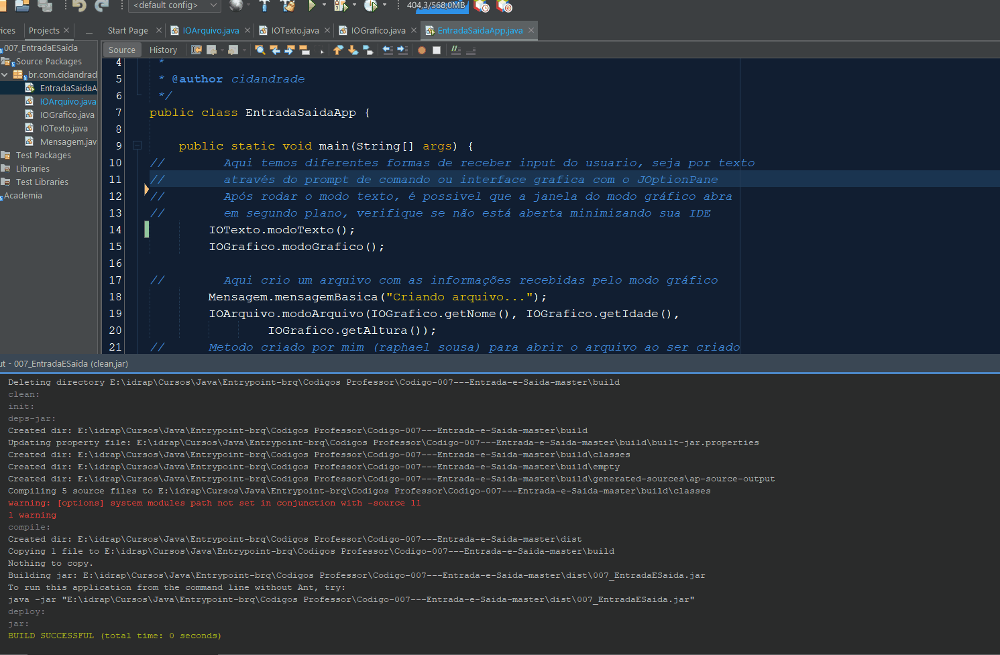

Versão modificada do código onde é possível criar um arquivo utilizando as informações recebidas pelo modo de input gráfico (JOptionPane) e também abre o arquivo ao criá-lo.

<!--  -->

## Funcioamento do Programa
Abaixo segue o funcionamento integral do programa. Como pode ser visto, após o modo texto (input via prompt de comando) ser executado, a janela gráfica pode aparecer em segundo plano e ser necessário minimizar a IDE para encontrá-la.
  
